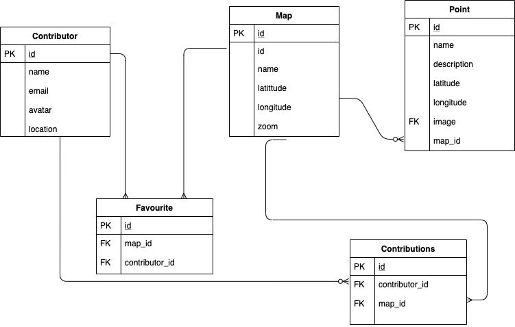
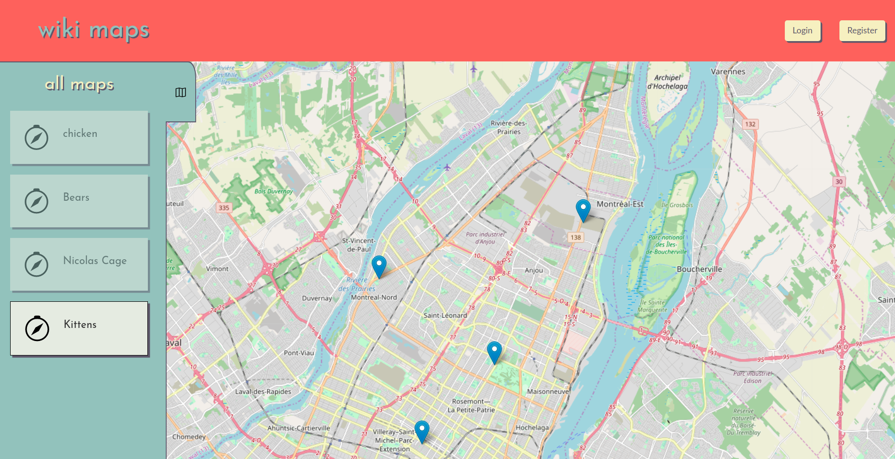
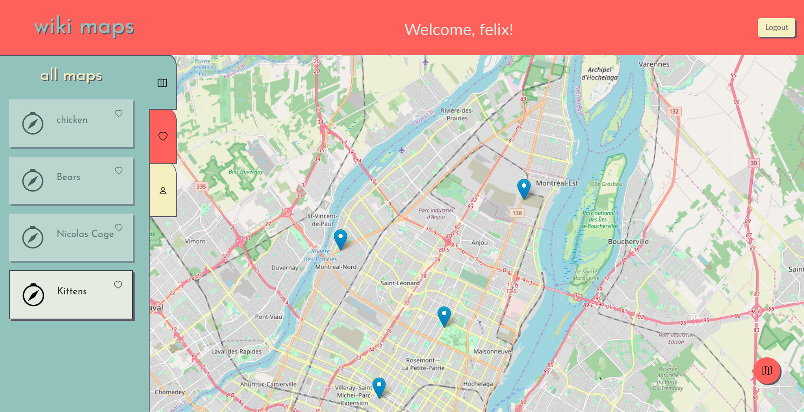
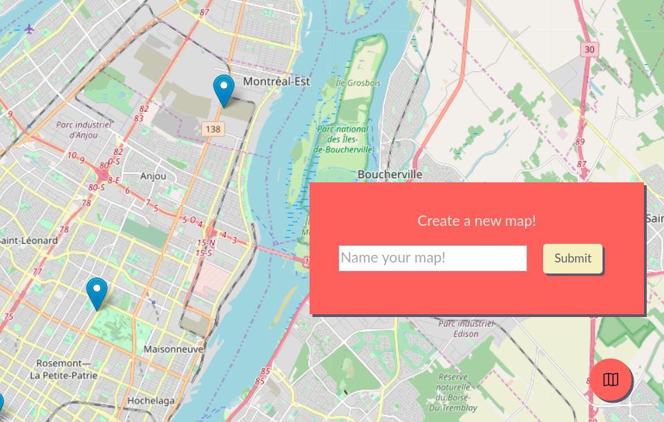
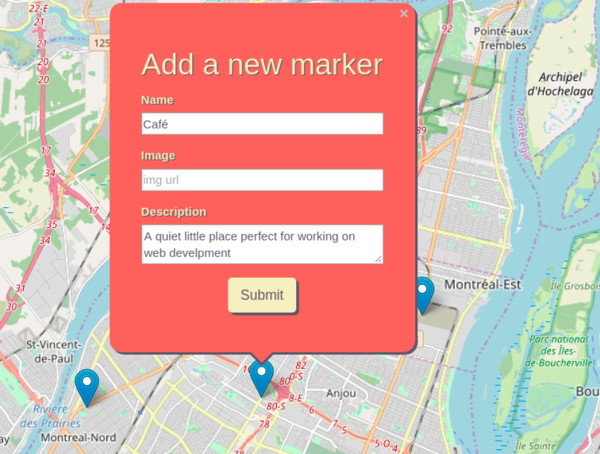
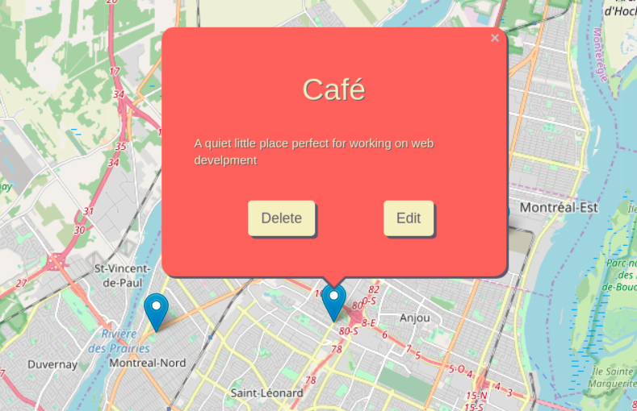

# WIKI MAPS

Wiki Maps is a web app using Leaflet which allows users to collaboratively create and edit maps. 

It was built by Felix Rioux Sabourin, Rayesh Rajah, and Camilo Pineda using Postgresql, jQuery, Express.js, Node.js and Sass.

## User stories

1. As a foodie, I like to keep track of all the best new restaurants in town, and save places according to my personal taste.
2. As an avid traveler, I like to see what other people are sharing about their own city.
3. As a travel agent, I like to help contribute to the points of interests of existing maps.
4. As someone with many different fields of interests, I like to be able to save my favourite resources and get back to them later.
5. As someone who enjoys collaboration, I want to be able to contribute by editing and improving other contributer's work.

## Features

___**Note:**___ a _visitor_ is someone who is visitig the site without being logged in. A _contributor_ has been authenticated and is logged in. Contributors can do everything that the visitor can do, plus more. There is no map ownership, or point ownership. All map content belongs to the contributors.

- Visitors can see a list of the available maps;
- Visitors can view a map;
- A map can contain many points;
- Each point can have: a title, description, and image;
- Contributors can create maps;
- Contributors can modify maps (add, edit, remove points);
- Contributors can favourite a map;
- Contributors have profiles, indicating their favourite maps and maps they've contributed to;

## Dependencies

- Node 10.x or above
- NPM 5.x or above
- PG 6.x

## Routes table

| HTTP method | URL pattern      | Use                          |
|------------:|-----------------:|-----------------------------:|
|GET          |/login            |Display login form            |
|GET          |/register         |Display register form         |
|GET          |/index            |Show the main page            |
|POST         |/maps:id          |Show a map with specific id   |
|POST         |/maps:id/edit     |Display form for editing map  |
|POST         |/points:id        |Show a point with specific id |
|POST         |/points:id/edit   |Display form for editing map  |
|DELETE       |/maps:id/delete   |Delete a single map           |
|DELETE       |/points:id/delete |Delete a single point         |

## ERD

## Finished product

